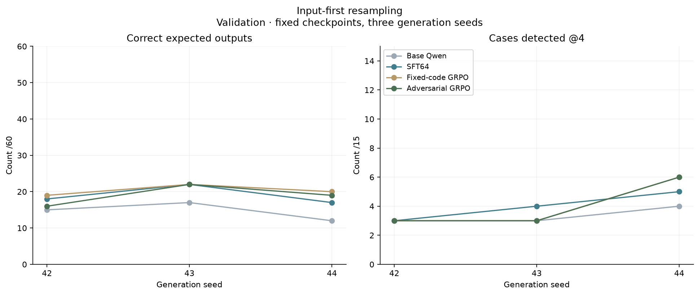

# Input-first resampling

Base Qwen, SFT64 and both GRPO branches evaluated with generation seeds 42/43/44.

| Configuration | Valid /60 | Correct expected /60 | Bug-detecting tests /60 | Functions detected /15 |
|---|---|---|---|---|
| Base Qwen | 35.33 ± 0.58 | 14.67 ± 2.52 | 3.67 ± 0.58 | 3.33 ± 0.58 |
| SFT64 | 43.33 ± 3.21 | 19.00 ± 2.65 | 5.33 ± 0.58 | 4.00 ± 1.00 |
| Fixed-code GRPO | 43.33 ± 3.21 | 20.33 ± 1.53 | 5.00 ± 1.73 | 4.00 ± 1.73 |
| Adversarial GRPO | 43.67 ± 3.06 | 19.00 ± 3.00 | 5.00 ± 1.00 | 4.00 ± 1.73 |

Mean ± sample SD across three generation seeds; one training run per configuration.

## Per-run counts

| Configuration | Generation seed | Valid /60 | Correct expected /60 | Bug-detecting tests /60 | Functions detected /15 |
|---|---|---|---|---|---|
| Base Qwen | 42 | 35 | 15 | 4 | 3 |
| SFT64 | 42 | 41 | 18 | 6 | 3 |
| Fixed-code GRPO | 42 | 41 | 19 | 4 | 3 |
| Adversarial GRPO | 42 | 41 | 16 | 5 | 3 |
| Base Qwen | 43 | 35 | 17 | 3 | 3 |
| SFT64 | 43 | 42 | 22 | 5 | 4 |
| Fixed-code GRPO | 43 | 42 | 22 | 4 | 3 |
| Adversarial GRPO | 43 | 43 | 22 | 4 | 3 |
| Base Qwen | 44 | 36 | 12 | 4 | 4 |
| SFT64 | 44 | 47 | 17 | 5 | 5 |
| Fixed-code GRPO | 44 | 47 | 20 | 7 | 6 |
| Adversarial GRPO | 44 | 47 | 19 | 6 | 6 |

The fixed-code branch detected 4.00/15 functions on average; the adversarial branch detected 4.00/15. Generation and filtering costs are recorded in costs.csv.

Figure 1. Input-first resampling.

## Data files

[costs.csv](costs.csv) · [costs.json](costs.json) · [metrics.csv](metrics.csv) · [metrics.json](metrics.json)

[Evaluation guide](../../docs/EXPERIMENTS.md).
